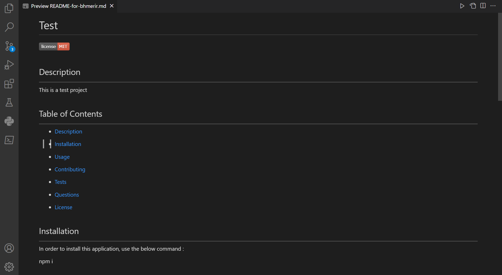

# Generating README File by Node.js

## Description 
---

Nowadays, the importance of adding a good README file to all projects which describes it in details is not a secret anymore. A good README file is consisted of a description about the project, the applied technology, the installation and the usage guideline, how to contribute to it, the test and questions parts, the credit section, and the license of that project. This application is written in order to help developpers to authomatically make a good README file only by answering some questions.

 

## Table of Contents
---

* [Description](#description)

* [Installation](#installation)

* [Usage](#usage)

* [Technology Used](#technology-used)

* [Questions](#questions)

* [Credit](#credit)

* [License](#license)

 

## Installation

---

In order to install this application, please go to my repository ([Link Here](https://github.com/Bhmerir/generating-README-file-by-NodeJS)) and clone it down. Then navigate to the root folder and write the below command in terminal :

npm i

 

## Usage

---

This is a link to a video which instructs the users on how to work with software : 

[Walk-through Video Link](https://drive.google.com/file/d/1eIm8vh2b5K8fObmj1TM07-Jq2-GFJ8Ov/view)

 

Here is the image of the resulting README file by this project:

 

Here is the link of it:

[Click the link here](https://github.com/Bhmerir/generating-README-file-by-NodeJS/blob/main/README-for-bhmerir.md)

 

## Technology Used

---

| Technology Used         |
| -------------           |
| JavaScript              |  
| Node.js                 |    
| Inquirer Node Package   | 

 

## Questions 

---

If you have any additional questions, you can send me an email to :

[My Email Address](mailto:(mer_ir@yahoo.com))

 

## Credit

---

Name:     Bahareh Hosseini

Github page:      [https://github.com/Bhmerir](https://github.com/Bhmerir)

 

## License

---

MIT License

Copyright (c) 2023 jonnyboy808; CTep09; Bhmerir; osuchaya

Permission is hereby granted, free of charge, to any person obtaining a copy
of this software and associated documentation files (the "Software"), to deal
in the Software without restriction, including without limitation the rights
to use, copy, modify, merge, publish, distribute, sublicense, and/or sell
copies of the Software, and to permit persons to whom the Software is
furnished to do so, subject to the following conditions:

The above copyright notice and this permission notice shall be included in all
copies or substantial portions of the Software.

THE SOFTWARE IS PROVIDED "AS IS", WITHOUT WARRANTY OF ANY KIND, EXPRESS OR
IMPLIED, INCLUDING BUT NOT LIMITED TO THE WARRANTIES OF MERCHANTABILITY,
FITNESS FOR A PARTICULAR PURPOSE AND NONINFRINGEMENT. IN NO EVENT SHALL THE
AUTHORS OR COPYRIGHT HOLDERS BE LIABLE FOR ANY CLAIM, DAMAGES OR OTHER
LIABILITY, WHETHER IN AN ACTION OF CONTRACT, TORT OR OTHERWISE, ARISING FROM,
OUT OF OR IN CONNECTION WITH THE SOFTWARE OR THE USE OR OTHER DEALINGS IN THE
SOFTWARE.

---

© 2023 Confidential and Proprietary. All Rights Reserved.
